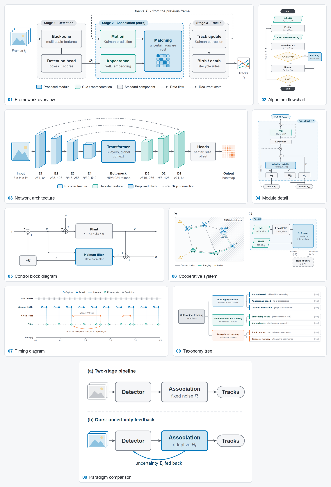
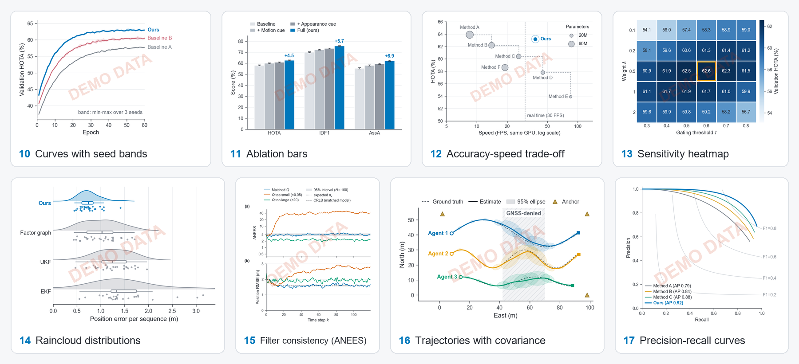
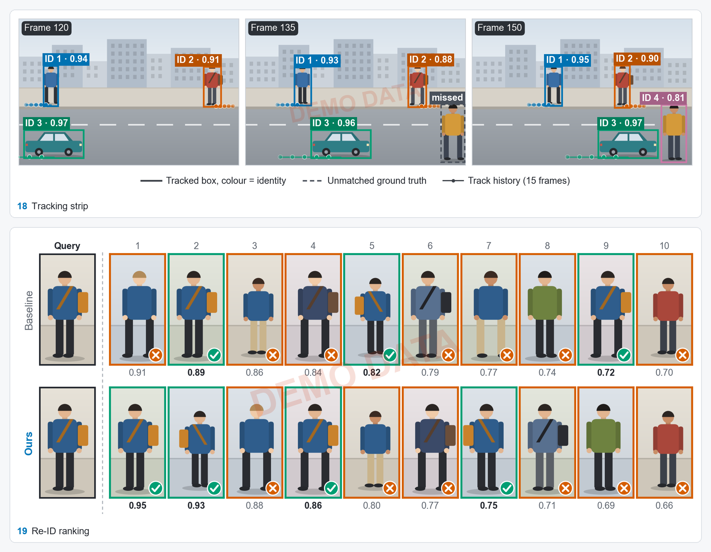

# cse-figure-studio · 科研绘图

[English](#english) | [中文](#中文)

Publication figures for detection, tracking, re-ID, cooperative navigation and filtering papers,
drawn at their printed size. Every image below was produced by the templates in this folder with
their built-in placeholder data, which is why each data plot carries a DEMO DATA stamp.

面向目标检测、跟踪、重识别、协同导航与滤波论文的出版级配图，按印刷尺寸绘制。下图全部由本目录的模板生成；
数据图使用的是内置占位数据，因此都带有 DEMO DATA 水印。







## English

### What it does

- **19 templates**: 9 diagrams (framework, flowchart, network, module, control loop, cooperative
  system, timing, taxonomy, teaser), 8 data plots (seed bands, ablation bars, trade-off scatter,
  heatmap, raincloud, ANEES consistency, trajectories with covariance, PR curves) and 2 qualitative
  figures (tracking strip, re-ID ranking).
- **Venue themes**: `default`, `ieee`, `elsevier`, `springer`, `aas` (自动化学报), with width keys
  for each venue or any measured `\columnwidth`. Chinese labels with `--lang zh`.
- **Checks that run on every save**: text below the theme minimum, overlapping or clipped text,
  hairlines, and a DEMO DATA stamp on every figure that still holds placeholder data.
- **Export**: PDF and SVG with embedded fonts, PNG at any dpi, vector EPS, and the greyscale raster
  EPS that 自动化学报 describes.

### Quick start

```powershell
python scripts/render.py --doctor                         # what this machine can build and export
python templates/12_tradeoff_scatter.py --out _out --theme ieee
python templates/15_consistency.py --out _out --theme aas --lang zh
python scripts/gallery.py --out _gallery                  # all templates; fails on any lint warning
```

Requirements: Python 3 with matplotlib and numpy for data plots; a Chrome, Edge or Chromium for
turning diagram SVGs into PDF/PNG; Pillow for previews; scipy optional. For an agent, the entry point
is [SKILL.md](SKILL.md); the details are in [references/](references/figure-catalog.md).

| File | Content |
|---|---|
| [SKILL.md](SKILL.md) | workflow, build report, red lines |
| [references/figure-catalog.md](references/figure-catalog.md) | the 19 templates and which figure each axis needs |
| [references/design-rules.md](references/design-rules.md) | typography, colour, layout, per-type rules, final check |
| [references/print-and-venue-specs.md](references/print-and-venue-specs.md) | IEEE, Elsevier, Springer, conference kits, 自动化学报, 控制理论与应用, with sources (checked 2026-10-04) |
| [references/api.md](references/api.md) | figkit, pubplot, render, gallery, demo_scene |

## 中文

### 能做什么

- **19 个模板**：9 个示意图（方法框架、算法流程、网络结构、模块细节、控制框图、协同系统、时序图、
  分类树、范式对比），8 个数据图（多种子置信带曲线、消融柱状图、精度-速度权衡散点、超参数热力图、
  云雨分布图、ANEES 一致性、带协方差椭圆的轨迹、PR 曲线），2 个定性图（跟踪帧序列、重识别排序）。
- **期刊主题**：`default`、`ieee`、`elsevier`、`springer`、`aas`（自动化学报），并提供各期刊的栏宽，
  也可直接传入实测的 `\columnwidth`。数据图加 `--lang zh` 即为中文标注（含公式的中文标签也能正常显示）。
- **每次保存自动检查**：字号低于主题下限、文字重叠或被裁切、过细线条；仍含占位数据的图一律加 DEMO DATA 水印，
  不会被误当成实验结果。
- **导出**：字体内嵌的 PDF/SVG、任意分辨率 PNG、矢量 EPS，以及自动化学报模板所述的灰度点阵 EPS。

### 快速使用

```powershell
python scripts/render.py --doctor                         # 检查本机可用的库、浏览器和中英文字体
python templates/12_tradeoff_scatter.py --out _out --theme ieee
python templates/15_consistency.py --out _out --theme aas --lang zh
python scripts/gallery.py --out _gallery                  # 运行全部模板，有任何检查警告即失败
```

对话中可以直接说：“用 cse-figure-studio 画一张 IEEE 单栏的消融柱状图，数据在 exp/ablation.csv”，
或“把这张轨迹图改成自动化学报单栏中文版”。没有真实数据时，技能只给带 DEMO 水印的版式预览，不会编造数值。

## License · 许可

No license is granted by default; see the [repository README](../../README.md). 默认不授予任何许可，
详见[仓库说明](../../README.zh.md)。
